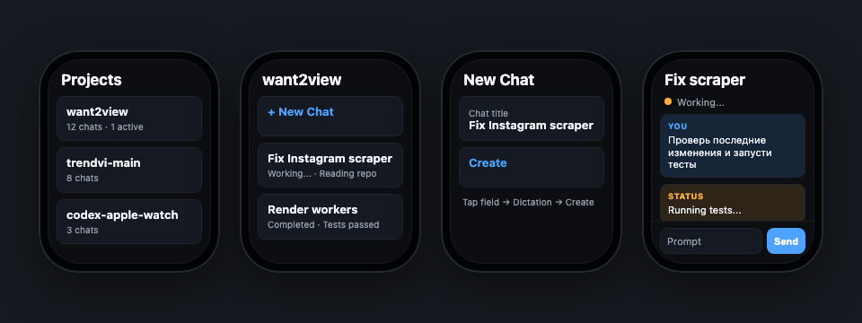

# Codex Watch Bridge


Codex Watch Bridge turns Apple Watch into a compact remote control for Codex: projects, chats, dictated prompts, new threads, live task status, long responses, and account limit visibility from your wrist.

**Project page:** https://ubtflow.com/codex-watch-bridge-page/

**Repository:** https://github.com/kirbudilov01/codex-watch-bridge



## Highlights

- **Real Codex threads, not mocks.** The bridge talks to Codex Desktop app-server first, then falls back to CLI/session files where needed.
- **Watch-first UX.** Native SwiftUI navigation, readable long messages, concise statuses, and standard watchOS dictation through `TextField`.
- **Remote-ready.** Use it on LAN or through a Mac-originated SSH reverse tunnel behind HTTPS.
- **Secret-safe by design.** The Apple Watch never receives OpenAI/Codex secrets; it only talks to your bridge.
- **Operational checks included.** `npm run check` validates backend tests, Swift build, and bridge doctor checks.

## What It Does

- Lists Codex projects on Apple Watch.
- Opens existing Codex chats and messages.
- Creates native Codex Desktop threads from the watch.
- Sends dictated prompts into the current thread.
- Shows normalized task states: `idle`, `queued`, `running`, `waiting_for_input`, `completed`, `failed`, `cancelled`.
- Shows account limit remaining percentage on the Home screen.
- Keeps OpenAI and Codex secrets server-side.
- Supports local LAN use and remote HTTPS access through a Mac-originated SSH reverse tunnel.

## Screens

The current watch flow is:

```text
Home -> Projects -> Project -> Chats -> Chat
Home -> Active / Status
Chats -> New Chat -> dictated title -> Chat
Chat -> dictated prompt -> live status -> Codex response
```

## Architecture

```text
Apple Watch
  -> HTTPS bridge API
    -> Mac launchd bridge
      -> Codex Desktop app-server
      -> Codex CLI fallback
      -> ~/.codex session JSONL fallback
```

The watch app never stores OpenAI or Codex API keys. It talks only to the bridge backend. The backend keeps watch-created display metadata in `~/.codex-watch-bridge` and uses Codex Desktop app-server when available.

## Requirements

- macOS with Xcode for building the watchOS app.
- Paired Apple Watch running watchOS 10.0 or later.
- Node.js for the local bridge.
- Codex Desktop running on the Mac for best thread/message support.
- Optional SSH server plus Nginx/Caddy/Cloudflare Tunnel for access away from home Wi-Fi.

## Quickstart

```sh
npm run check
npm run doctor
npm run dev
```

Default local URL:

```text
http://127.0.0.1:8765
```

For a physical Apple Watch, use either the LAN URL printed by `npm run dev` or a public HTTPS reverse proxy URL in `WatchApp/Config.xcconfig`.

Use `WatchApp/Config.example.xcconfig` as the safe template:

```xcconfig
PRODUCT_BUNDLE_IDENTIFIER = com.example.codexwatch
DEVELOPMENT_TEAM =
CODEX_BRIDGE_URL = https:/$()/YOUR_DOMAIN/codex-watch-bridge/
CODEX_BRIDGE_TOKEN =
MARKETING_VERSION = 0.1
CURRENT_PROJECT_VERSION = 1
```

The `http:/$()/...` and `https:/$()/...` form is intentional because `//` starts comments in `.xcconfig` files.

## Remote Access

For using the watch away from the home Wi-Fi, keep Codex Desktop running on the Mac and expose the local bridge through a server-side HTTPS reverse proxy plus a Mac-originated SSH reverse tunnel:

```sh
npm run service:install
npm run tunnel:install
npm run service:status
npm run tunnel:status
```

The tunnel service maps a loopback port on the SSH server to the Mac bridge at `127.0.0.1:8767`. Nginx can then proxy a public HTTPS path such as `/codex-watch-bridge/` to that loopback port.

## API

- `GET /health`
- `GET /projects`
- `GET /limits`
- `GET /projects/:projectId/threads`
- `POST /projects/:projectId/threads`
- `GET /threads/:threadId`
- `GET /threads/:threadId/messages`
- `POST /threads/:threadId/messages`
- `GET /threads/:threadId/status`

## Watch App

Open `CodexAppleWatch.xcodeproj` in Xcode, set your Apple Developer Team on the `CodexWatchApp` target, and run the app on a paired Apple Watch.

Swift sources are under `WatchApp/`. The app uses native watchOS `TextField` input, so dictation works through standard watchOS behavior.

## Checks

```sh
npm test
swift build
npm run doctor
```

For a generic watchOS build:

```sh
DEVELOPER_DIR=/Applications/Xcode.app/Contents/Developer \
xcodebuild \
  -project CodexAppleWatch.xcodeproj \
  -scheme CodexWatchApp \
  -destination 'generic/platform=watchOS' \
  CODE_SIGNING_ALLOWED=NO \
  build
```

## Repository Health

This repo follows a small open-source hygiene set:

- MIT license.
- Contribution guide.
- Security policy.
- Issue and pull request templates.
- Ignored local secrets and watch configuration.
- Reproducible local checks through `npm run check`.

## Security and Operations

- See `SECURITY.md` for secret-handling and public exposure rules.
- See `docs/OPERATIONS.md` for launchd, tunnel, and slow-project-list troubleshooting.
- Do not commit `WatchApp/Config.xcconfig`; it can contain a bridge bearer token.

## License

MIT
